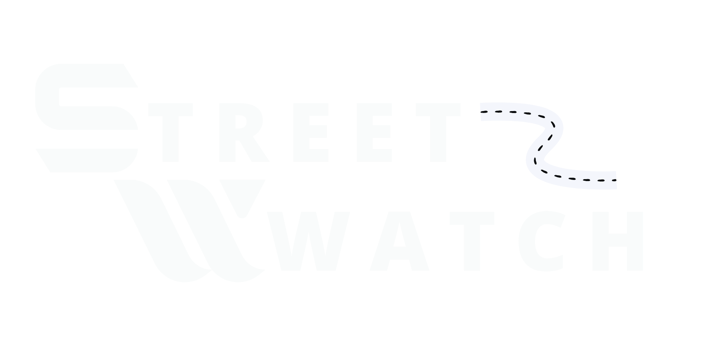

<div align="center">


**Platform Monitoring Jalan Rusak Berbasis AI untuk Indonesia**

[](https://nextjs.org)
[](https://typescriptlang.org)
[](https://tailwindcss.com)
[](https://ui.shadcn.com)
[](https://streetwatch.vercel.app)
[](LICENSE)

[Demo Live](https://streetwatch.vercel.app) · [Laporkan Bug](https://github.com/your-org/streetwatch/issues) · [Diskusi](https://github.com/orgs/StreetWatch-CC26/discussions)

</div>

---

## Tentang Proyek

StreetWatch adalah platform civic-tech yang menghubungkan **warga, pemerintah daerah, dan teknologi AI** untuk mempercepat penanganan kerusakan jalan di seluruh Indonesia. Warga melaporkan kerusakan melalui foto, AI menganalisis tingkat keparahan secara otomatis, dan laporan langsung masuk ke dashboard Dinas PU terkait.

Proyek ini merupakan **Capstone Project 2026** yang dikembangkan sebagai solusi atas permasalahan nyata infrastruktur jalan di Indonesia — di mana rata-rata waktu respons perbaikan nasional masih berada di angka 45+ hari.

### Masalah yang Diselesaikan

Pelaporan kerusakan jalan selama ini terjebak dalam siklus yang tidak efisien: warga tidak tahu cara melapor, laporan tidak terstruktur, pemerintah tidak punya data yang cukup untuk memprioritaskan perbaikan. StreetWatch memutus siklus ini dengan menghadirkan satu platform terpadu yang dapat diakses semua pihak.

---

## Fitur Utama

### Untuk Warga (Pelapor)

**Peta Sebaran Real-time** — Visualisasi seluruh laporan aktif menggunakan Leaflet.js dengan marker cluster. Laporan dikelompokkan otomatis saat zoom out dan dapat difilter berdasarkan provinsi dan kabupaten/kota seluruh Indonesia. Setiap marker dapat diklik untuk melihat detail laporan lengkap beserta tombol "Dukung."

**StreetWatch AI Playground** — Upload foto kondisi jalan, AI akan menganalisis dan menghasilkan klasifikasi kerusakan (lubang, retak, amblas, longsor, bergelombang), skor keparahan 0–100, tingkat urgensi (rendah/sedang/tinggi), dan rekomendasi tindak lanjut yang spesifik. Hasil analisis secara otomatis mengisi form laporan — tidak ada input berulang.

**Buat Laporan dengan GPS** — Form tiga langkah dengan deteksi lokasi otomatis via Geolocation API dan reverse geocoding ke nama jalan/kecamatan/kota. Upload foto hingga 4 gambar dengan preview langsung.

**Profil & Gamifikasi** — Sistem poin dan badge untuk mendorong partisipasi aktif warga. Setiap laporan, verifikasi, dan penyelesaian menghasilkan poin. Level progression dari Pelapor Baru hingga Legenda Kota.

### Halaman Publik

Platform memiliki halaman publik lengkap untuk membangun kepercayaan dan mendorong kemitraan: landing page dengan mockup dashboard interaktif, halaman About Us dengan cerita tim dan nilai-nilai, serta halaman Partnership dengan formulir kemitraan untuk pemerintah daerah.

---

## Tech Stack

### Core

| Teknologi                                | Versi           | Kegunaan                         |
| ---------------------------------------- | --------------- | -------------------------------- |
| [Next.js](https://nextjs.org)            | 15 (App Router) | Framework utama, SSR, API Routes |
| [TypeScript](https://typescriptlang.org) | 5.x             | Type safety seluruh codebase     |
| [React](https://react.dev)               | 19              | UI library                       |

### Styling & UI

| Teknologi                                                       | Kegunaan                                                          |
| --------------------------------------------------------------- | ----------------------------------------------------------------- |
| [Tailwind CSS v4](https://tailwindcss.com)                      | Utility-first styling dengan CSS variables                        |
| [shadcn/ui](https://ui.shadcn.com)                              | Komponen UI: Sidebar, Accordion, Tabs, Select, Avatar, Badge, dll |
| [tw-animate-css](https://github.com/Wombosvideo/tw-animate-css) | Animate utilities (fade-in, slide-in)                             |
| Geist + Playfair Display                                        | Font sans (UI) + serif (heading editorial)                        |
| OKLCH color space                                               | Design token sistem warna perceptually-uniform                    |

### Peta & Geospasial

| Teknologi                                                                       | Kegunaan                                                                 |
| ------------------------------------------------------------------------------- | ------------------------------------------------------------------------ |
| [Leaflet.js](https://leafletjs.com) 1.9.4                                       | Peta interaktif OpenStreetMap                                            |
| [leaflet.markercluster](https://github.com/Leaflet/Leaflet.markercluster) 1.5.3 | Merge marker otomatis saat zoom out                                      |
| [ibnux/data-indonesia](https://github.com/ibnux/data-indonesia)                 | Data dropdown wilayah (via Next.js proxy)                                |
| `data/wilayah-coords.ts`                                                        | 38 provinsi + ~100 kabupaten/kota bundled statis untuk zero-latency zoom |
| Nominatim (OpenStreetMap)                                                       | Reverse geocoding GPS → nama jalan                                       |

### State Management

| Teknologi                               | Kegunaan                                                |
| --------------------------------------- | ------------------------------------------------------- |
| [Zustand](https://zustand-demo.pmnd.rs) | Global store ringan (playground → report state sharing) |
| `persist` + `sessionStorage`            | Hasil analisis AI bertahan saat navigasi antar halaman  |
| React `useState` / `useCallback`        | Local component state                                   |

### Tooling

| Teknologi                                 | Kegunaan                     |
| ----------------------------------------- | ---------------------------- |
| [date-fns](https://date-fns.org)          | Format tanggal (locale `id`) |
| [@remixicon/react](https://remixicon.com) | Icon set navigasi mobile     |
| [lucide-react](https://lucide.dev)        | Icon set UI umum             |

---

## Keputusan Arsitektur Penting

### Mobile-First Layout Dua Mode

Dashboard menggunakan layout responsif yang berbeda secara fundamental antara mobile dan desktop — bukan sekadar hide/show elemen. Desktop mendapat **Shadcn Sidebar** collapsible dengan navigasi teks + breadcrumb di header. Mobile mendapat **bottom navigation floating pill** dengan icon-only + CTA "Buat Laporan" yang elevated di tengah, dan **MobileHeader** compact dengan judul halaman dinamis berdasarkan route aktif.

### State Sharing Playground → Report tanpa Re-analyze

Hasil analisis AI disimpan di Zustand store yang dipersist ke `sessionStorage`. Ketika user navigasi dari `/dashboard/playground` ke `/dashboard/report/new`, form laporan membaca store dan mengisi field secara otomatis — judul, kategori, dan rekomendasi sudah terisi. Setelah submit, `store.clear()` dipanggil untuk mencegah data lama mengisi form berikutnya.

### Zero-Latency Zoom Map

Filter wilayah di peta tidak bergantung pada API eksternal untuk menentukan posisi kamera. Koordinat centroid 38 provinsi dan ~100 kabupaten/kota dibundle langsung di `data/wilayah-coords.ts` sebagai TypeScript module. Saat user memilih wilayah, `flyTo()` dipanggil secara instan — tidak ada loading state, tidak ada CORS, tidak ada network request.

### Proxy API untuk CORS ibnux

ibnux.github.io memiliki proteksi CORS yang mencegah fetch langsung dari browser. Solusinya adalah Next.js API Route Handler di `/api/wilayah/[...path]/route.ts` yang bertindak sebagai proxy server-side — browser hanya fetch ke domain yang sama, server Next.js yang forward ke ibnux (server-to-server bebas CORS). Response di-cache selama 24 jam di edge.

### Strict Mode Safe Leaflet

React Strict Mode me-mount komponen dua kali di development, menyebabkan Leaflet crash dengan error "Map container is already initialized." Fix diterapkan dengan tiga lapis perlindungan: flag `isMounted` untuk membatalkan async import yang in-flight, penghapusan `_leaflet_id` dari DOM container sebelum init, dan reset `LRef.current` di cleanup function.

---

## Memulai

### Prasyarat

- Node.js 20+
- npm / pnpm / yarn
- Git

### Instalasi

```bash
# Clone repository
git clone https://github.com/your-org/streetwatch.git
cd streetwatch

# Install dependencies
npm install

# Copy environment variables
cp .env.example .env.local
```

### Environment Variables

```bash
# .env.local

# Wajib untuk production (opsional untuk development dengan mock data)
ANTHROPIC_API_KEY=sk-ant-...       # Untuk Claude Vision API (fitur AI production)

# Opsional
NEXT_PUBLIC_APP_URL=http://localhost:3000
```

> Development menggunakan mock data — semua fitur berjalan tanpa API key eksternal.

### Menjalankan Development Server

```bash
npm run dev
# Buka http://localhost:3000
```

### Build Production

```bash
npm run build
npm run start
```

---

## Instalasi Dependensi Tambahan

Beberapa paket perlu diinstall secara manual:

```bash
# Peta
npm install leaflet
npm install -D @types/leaflet

# State management
npm install zustand

# Date formatting
npm install date-fns

# Icons
npm install lucide-react @remixicon/react

# shadcn/ui components (jalankan satu per satu sesuai kebutuhan)
npx shadcn@latest add sidebar
npx shadcn@latest add accordion
npx shadcn@latest add tabs
npx shadcn@latest add select
npx shadcn@latest add label
npx shadcn@latest add textarea
npx shadcn@latest add avatar
npx shadcn@latest add badge
npx shadcn@latest add button
npx shadcn@latest add input
npx shadcn@latest add separator
npx shadcn@latest add breadcrumb
```

---

## Halaman & Route

| Route                    | Deskripsi                              | Akses    |
| ------------------------ | -------------------------------------- | -------- |
| `/`                      | Landing page                           | Publik   |
| `/about`                 | Tentang tim dan misi                   | Publik   |
| `/partnership`           | Program kemitraan pemerintah           | Publik   |
| `/contact`               | Hubungi Kami                           | Publik   |
| `/dashboard`             | Overview + Redirect → `/dashboard/map` | Auth     |
| `/dashboard/map`         | Peta sebaran laporan                   | Auth     |
| `/dashboard/playground`  | StreetWatch AI Analyzer                | Auth     |
| `/dashboard/reports`     | Daftar Laporan                         | Auth     |
| `/dashboard/reports/new` | Buat laporan baru                      | Auth     |
| `/dashboard/profile`     | Profil, badge, riwayat                 | Auth     |
| `/api/wilayah/[...path]` | Proxy ibnux wilayah API                | Internal |

---

## Design System

StreetWatch menggunakan sistem desain berbasis **OKLCH color space** untuk warna yang konsisten di berbagai tampilan. Token warna didefinisikan di `globals.css` menggunakan CSS custom properties, sehingga dark mode berfungsi tanpa JavaScript tambahan.

```css
/* Primary — Teal */
--primary: oklch(0.511 0.096 186.391); /* Light mode */
--primary: oklch(0.437 0.078 188.216); /* Dark mode */

/* Radius system */
--radius: 0.875rem; /* Base — semua varian dihitung dari sini */
```

Font heading menggunakan **Playfair Display** (serif) untuk nuansa editorial yang trustworthy sesuai karakter civic-tech. Body text menggunakan **Geist Sans**, monospace menggunakan **Geist Mono**.

Urgensi laporan dikodekan dengan warna konsisten di seluruh UI: merah (kritis), oranye (tinggi), kuning (sedang), hijau (rendah).

---

## Arsitektur Proyek

```
streetwatch-fe
├─ AGENTS.md
├─ CLAUDE.md
├─ components.json
├─ eslint.config.mjs
├─ middleware.ts
├─ next.config.ts
├─ package-lock.json
├─ package.json
├─ postcss.config.mjs
├─ prisma
│  ├─ migrations
│  │  ├─ 20260508183305_init
│  │  │  └─ migration.sql
│  │  ├─ 20260508191500_change_image_url_type_to_string
│  │  │  └─ migration.sql
│  │  └─ migration_lock.toml
│  ├─ schema.prisma
│  └─ seed.ts
├─ prisma.config.ts
│
├─ public
│
├─ README.md
├─ src
│  ├─ app
│  │  ├─ (auth)
│  │  │  ├─ login
│  │  │  │  └─ page.tsx
│  │  │  ├─ register
│  │  │  │  └─ page.tsx
│  │  │  └─ set-password
│  │  │     └─ page.tsx
│  │  ├─ (onboarding)
│  │  │  ├─ layout.tsx
│  │  │  └─ welcome
│  │  │     └─ page.tsx
│  │  ├─ (public)
│  │  │  ├─ about
│  │  │  │  └─ page.tsx
│  │  │  ├─ contact
│  │  │  │  └─ page.tsx
│  │  │  ├─ layout.tsx
│  │  │  ├─ page.tsx
│  │  │  └─ partnership
│  │  │     └─ page.tsx
│  │  ├─ api
│  │  │  ├─ analytics
│  │  │  │  └─ route.ts
│  │  │  ├─ auth
│  │  │  │  ├─ register
│  │  │  │  │  └─ route.ts
│  │  │  │  ├─ set-password
│  │  │  │  │  └─ route.ts
│  │  │  │  └─ [...nextauth]
│  │  │  │     └─ route.ts
│  │  │  ├─ reports
│  │  │  │  ├─ map
│  │  │  │  │  └─ route.ts
│  │  │  │  ├─ route.ts
│  │  │  │  └─ [id]
│  │  │  │     ├─ route.ts
│  │  │  │     └─ upvote
│  │  │  │        └─ route.ts
│  │  │  ├─ upload
│  │  │  │  └─ route.ts
│  │  │  ├─ user
│  │  │  │  ├─ badges
│  │  │  │  │  └─ route.ts
│  │  │  │  ├─ me
│  │  │  │  │  └─ route.ts
│  │  │  │  ├─ reports
│  │  │  │  │  └─ route.ts
│  │  │  │  └─ stats
│  │  │  │     └─ route.ts
│  │  │  └─ wilayah
│  │  │     └─ [...path]
│  │  │        └─ route.ts
│  │  ├─ apple-touch-icon.png
│  │  ├─ dashboard
│  │  │  ├─ layout.tsx
│  │  │  ├─ map
│  │  │  │  └─ page.tsx
│  │  │  ├─ overview
│  │  │  │  └─ page.tsx
│  │  │  ├─ page.tsx
│  │  │  ├─ playground
│  │  │  │  └─ page.tsx
│  │  │  ├─ profile
│  │  │  │  └─ page.tsx
│  │  │  └─ reports
│  │  │     ├─ new
│  │  │     │  └─ page.tsx
│  │  │     ├─ page.tsx
│  │  │     └─ [id]
│  │  │        └─ page.tsx
│  │  ├─ favicon.ico
│  │  ├─ globals.css
│  │  ├─ layout.tsx
│  │  └─ manifest.ts
│  ├─ components
│  │  ├─ about
│  │  │  ├─ MissionSection.tsx
│  │  │  ├─ PressSection.tsx
│  │  │  └─ ValuesSection.tsx
│  │  ├─ add-report
│  │  │  ├─ AddReportForm.tsx
│  │  │  ├─ FormInput.tsx
│  │  │  └─ LocationPicker.tsx
│  │  ├─ auth
│  │  │  ├─ LoginForm.tsx
│  │  │  ├─ RegisterForm.tsx
│  │  │  └─ SetPasswordForm.tsx
│  │  ├─ contact
│  │  │  └─ ContactForm.tsx
│  │  ├─ landing
│  │  │  ├─ HeroSection.tsx
│  │  │  ├─ HowItWorksSection .tsx
│  │  │  └─ ImpactSection.tsx
│  │  ├─ map
│  │  │  ├─ LeafletMap.tsx
│  │  │  ├─ MapLegend.tsx
│  │  │  └─ WilayahFilterBar.tsx
│  │  ├─ onboarding
│  │  │  ├─ onboarding-data.ts
│  │  │  ├─ OnBoardingFlow.tsx
│  │  │  ├─ StepContent.tsx
│  │  ├─ partnership
│  │  │  ├─ PartnershipHero.tsx
│  │  │  ├─ PartnershipTiers.tsx
│  │  │  └─ ProcessSection.tsx
│  │  ├─ playground
│  │  │  ├─ AnalysisResultCard.tsx
│  │  │  ├─ ImageDropzone.tsx
│  │  │  └─ ScannerOverlay.tsx
│  │  ├─ providers
│  │  │  ├─ SessionProviderClient.tsx
│  │  │  └─ theme-provider.tsx
│  │  ├─ shared
│  │  │  ├─ Footer.tsx
│  │  │  ├─ Navbar.tsx
│  │  │  └─ ToastListener.tsx
│  │  ├─ sidebar
│  │  │  ├─ AppSidebar.tsx
│  │  │  └─ VersionSwitcher.tsx
│  │  └─ ui
│  │     ├─ accordion.tsx
│  │     ├─ textarea.tsx
│  │     └─ tooltip.tsx
│  ├─ data
│  │  ├─ mockReport.ts
│  │  └─ wilayahCoord.ts
│  ├─ generated
│  ├─ hooks
│  │  ├─ useAnalysis.ts
│  │  ├─ useAuth.ts
│  │  └─ useWilayahFilter.ts
│  ├─ lib
│  │  ├─ auth.ts
│  │  ├─ metadata.ts
│  │  └─ utils.ts
│  ├─ repositories
│  │  ├─ report.repository.ts
│  │  ├─ upvote.repository.ts
│  │  └─ user.repository.ts
│  ├─ services
│  │  ├─ storage.service.ts
│  │  ├─ upvote.service.ts
│  │  └─ user.service.ts
│  ├─ stores
│  │  └─ analysis.store.ts
│  ├─ types
│  │  └─ next-auth.d.ts
│  └─ validations
│     ├─ report.validation.ts
│     └─ user.validation.ts
├─ tailwind.config.js
└─ tsconfig.json

```

---

## Roadmap

### v1.0 — Foundation ✅ (Saat Ini)

- Landing page, About, Partnership
- Dashboard layout responsive (sidebar + mobile bottom nav)
- Peta sebaran dengan Leaflet + MarkerCluster
- Filter wilayah Provinsi + Kab/Kota (38 provinsi)
- StreetWatch AI Playground (mock engine)
- Buat laporan dengan GPS + prefill dari AI
- Profil dengan badge dan sistem poin

### v1.1 — Backend Integration ✅ (Saat Ini)

- Autentikasi (NextAuth.js / Supabase Auth)
- Database PostgreSQL via Prisma ORM
- API endpoint CRUD laporan
- Ganti mock data dengan data real
- Ganti mock AI engine dengan Claude Vision API
- Push notification (laporan diverifikasi / selesai)

### v1.2 — Partnership Dashboard 📋

- Role-based access control (warga vs. partnership vs. admin)
- Dashboard partnership: manajemen tim lapangan, SLA tracking
- Export laporan ke PDF/Excel
- Integrasi sistem e-PU pemerintah daerah

### v2.0 — Scale 🚀

- PWA dengan offline capability
- Clustering laporan menggunakan spatial index (PostGIS)
- Model AI custom terlatih dengan data jalan Indonesia
- Integrasi peta OSM dengan routing untuk tim lapangan
- API publik untuk third-party integration

---

## Kontribusi

Proyek ini terbuka untuk kontribusi. Silakan baca panduan kontribusi sebelum membuat pull request.

```bash
# Fork repository, lalu:
git checkout -b feature/nama-fitur
git commit -m "feat: deskripsi singkat"
git push origin feature/nama-fitur
# Buat Pull Request ke branch main
```

Konvensi commit mengikuti [Conventional Commits](https://www.conventionalcommits.org/): `feat`, `fix`, `docs`, `refactor`, `chore`.

---

## Tim

Dikembangkan oleh tim **StreetWatch - Capstone 2026** dari Coding Camp — sekelompok developer yang percaya bahwa teknologi dapat memperbaiki pelayanan publik Indonesia.

---

## Lisensi

MIT License — lihat file [LICENSE](LICENSE) untuk detail lengkap.

---

## Kredit & Referensi

- Data wilayah Indonesia: [ibnux/data-indonesia](https://github.com/ibnux/data-indonesia) (MIT)
- Koordinat kabupaten/kota: [yusufsyaifudin/wilayah-indonesia](https://github.com/yusufsyaifudin/wilayah-indonesia) (MIT)
- Tile map: [OpenStreetMap](https://www.openstreetmap.org/) contributors (ODbL)
- UI components: [shadcn/ui](https://ui.shadcn.com) (MIT)
- Icons: [Lucide](https://lucide.dev) + [Remix Icon](https://remixicon.com) (MIT)

---

<div align="center">
  <sub>Dibuat dengan ❤️ untuk infrastruktur Indonesia yang lebih baik · NKRI, 2026</sub>
</div>
